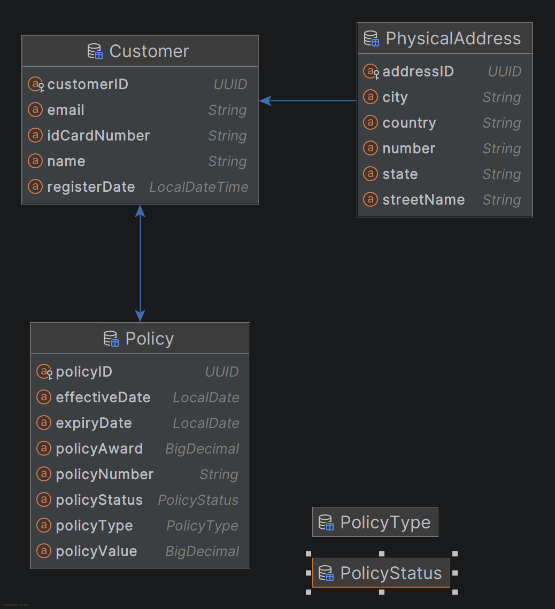

# Project Grey APP
## Objective: Insurance Policy Management - Design Patterns and Refactoring

### Project Structure



```text

Project design patterns
=======
│
├── creational
│   ├── builder  | Complex object construction |
│   ├── factory | Insurance object creation |
│   └── singleton
│
├── structural
│   ├── adapter  | External service integration |
│   └── facade  | Simplifies policy issuance workflow |
│
├── behavioral
│   ├── strategy | Premium calculation algorithms |
│   ├── observer | Event notification mechanism |
│   └── chain-of-responsibility | Validation pipeline |
│
└── refactoring
```
| Packages   | Responsibility | 
|------------|---------------|
| controller | Handles REST API requests |
| service    | Contains business logic |
| repository | Database access layer |
| entity     | Domain and JPA entities |
| dto        | Request and response objects |
| exception  | Custom exception handling |

## Main Application Flow

```text
PolicyController
        ↓
PolicyService
        ↓
PolicyIssuanceFacade
        ↓
CPFValidator
        ↓
PremiumCalculationStrategy
        ↓
PolicyRepository
```